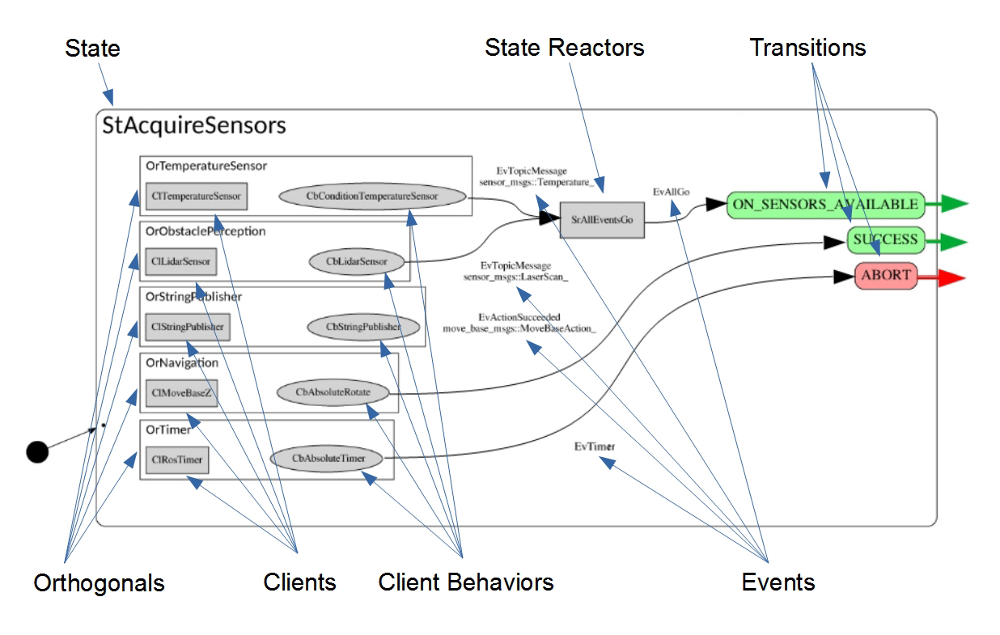
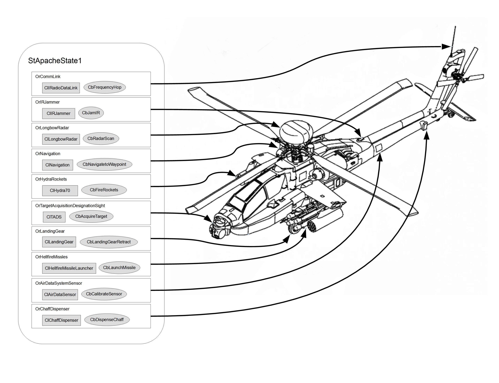
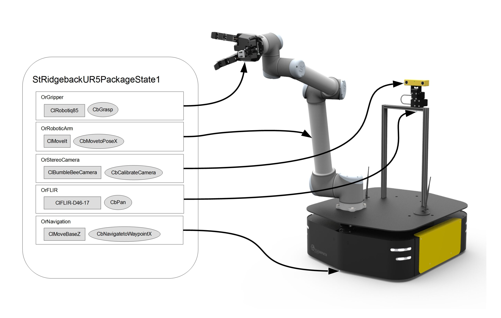
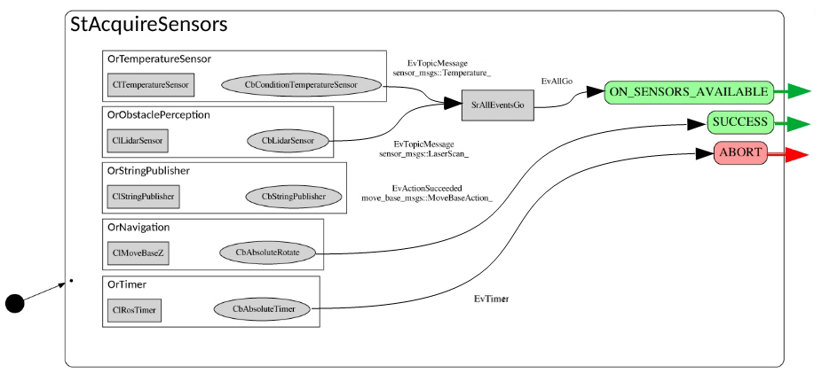
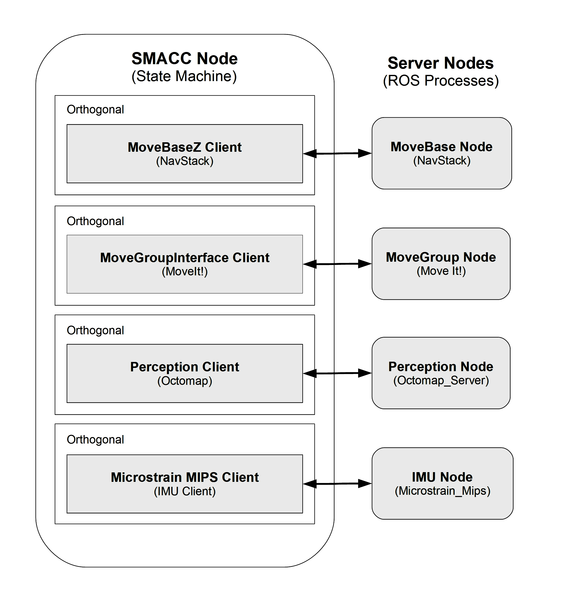

Concepts II - Substate Architecture
=====

Object Lifetimes
------------

SMACC2 runtime objects fall into two categories based on their lifetime:

**State Machine-Scoped Objects** persist for the entire lifetime of the state machine. These are created once at startup and exist until the state machine shuts down:

- State Machines (Sm)
- Orthogonals (Or)
- Clients (Cl)
- Components (Cp)

**State-Scoped Objects** are created when a state is entered and destroyed when that state is exited. Their lifetime is tied to the individual state transition:

- States (St)
- Client Behaviors (Cb)
- State Reactors (Sr)
- Event Generators (Eg)

Understanding this distinction is essential. Because client behaviors are state-scoped, they are the right place for state-specific logic. Because clients and components are state machine-scoped, they are the right place for persistent connections, shared data, and hardware interfaces that must survive state transitions.

|
|

Intro to Substate Objects
------------

State Machines, are ultimately about the organization of code.

Let’s take a look at the taxonomy of SMACC objects inside of leaf state below, StAcquireSensors…

Let’s go through the objects one by one…

**Orthogonals:** Orthogonals are persistent for the life of the state machine. They can conceptually be thought of as modular slots for the hardware devices that comprise a robot. Every Orthogonal should contain at least one client, and may contain multiple client behaviors. For more on orthogonals, click here.

**Clients:** Client objects are persistent for the life of the state machine. They are typically used to do things like, manage connections to outside nodes and devices, and contain code that we would want executed regardless of the current state. Clients are an important source of events.

**Client Behaviors:** Client behaviors are objects that are persistent for the life of the state. For this reason, they are used to execute state specific behaviors. In a given state, there can be multiple client behaviors in any orthogonal.

**State Reactors:** State Reactors are objects that receive events, and then generate one or more events. A good example of their use in practice, is the case of the state reactor, SrAllEventsGo. This State Reactor was created to deal with the following use case… A robot enters a state (in this case StAcquireSensors) where it wants to confirm that two different sensors have both been loaded and are working properly before moving onto the next state. So in this case, SrAllEventsGo needs to recieve two events, one from the temperature sensor orthogonal, and one from the lidar sensor, before the state reactor throws it’s own event, EvAllGo, which triggers the transition to next state.

**Events:** SMACC is an event-driven state machine library. As can be seen in the above example, events are created by Clients & Client Behaviors (although they can be created by States as well), then they are consumed by State Reactors & States. With the main difference being that State Reactors input events and output events, while states input events and output transitions.

Here is the code for the example image above…

.. code-block:: c++

   #include <smacc2/smacc.hpp>
   namespace sm_example
   {
   using namespace smacc2::default_transition_tags;
   using namespace smacc2::state_reactors;

   // STATE DECLARATION
   struct StAcquireSensors : smacc2::SmaccState<StAcquireSensors, MsRunMode>
   {
     using SmaccState::SmaccState;

     // DECLARE CUSTOM OBJECT TAGS
     struct ON_SENSORS_AVAILABLE : SUCCESS{};

     // TRANSITION TABLE
     typedef mpl::list<

       Transition<EvAllGo<SrAllEventsGo>, StEventCountDown, ON_SENSORS_AVAILABLE>,
       Transition<EvActionSucceeded<CbAbsoluteRotate, OrNavigation>, StEventCountDown, SUCCESS>,
       Transition<EvTimer<CbTimerCountdownOnce, OrTimer>, StPreviousState, ABORT>

       >reactions;

     // STATE FUNCTIONS
     static void staticConfigure()
     {
       configure_orthogonal<OrTemperatureSensor, CbConditionTemperatureSensor>();
       configure_orthogonal<OrObstaclePerception, CbLidarSensor>();
       configure_orthogonal<OrStringPublisher, CbStringPublisher>("Hello World!");
       configure_orthogonal<OrNavigation, CbAbsoluteRotate>(360);
       configure_orthogonal<OrTimer, CbTimerCountdownOnce>(10);

       // Create State Reactor
       static_createStateReactor<
         SrAllEventsGo,
         EvAllGo<SrAllEventsGo>,
         mpl::list<
           EvTopicMessage<CbLidarSensor, OrObstaclePerception>,
           EvTopicMessage<CbConditionTemperatureSensor, OrTemperatureSensor>>>();
     }
   };
   }  // namespace sm_example

|
|

Orthogonals
----------------

*“An obvious application of orthogonality is in splitting a state in accordance with its physical subsystems.”* – Harel (1987) pg. 14

Orthogonality, one of the three additions to state machine formalism originally contributed by Harel in his 1987 paper, is absolutely crucial for the construction of complex robotic state machines. This is because complex robots are, almost by definition, amalgamations of hardware components such as sensors, cameras, actuators, encoders, sub-assemblies, etc.

In SMACC, Orthogonals are classes, defined by header files in their respective state machine, created by the State Machine upon start-up, then inherited by every Leaf State in that state machine, that serve as a container for clients, client behaviors, orthogonal components, maybe shared pointers. For the most common use cases, they contain one Client, and either zero, one or multiple client behaviors in any one state.

They also function as namespace (I like to think of them as a last name), that allows you to specify and differentiate between multiple instances of the same client in one state machine. For example, imagine a robot that has two arms, that both use their own instance of the SMACC MoveIt Client found in the SMACC client library, each running in a unique orthogonal (like OrLeftArm, OrRightArm).

The typical case, is that each device, such as an imu, a lidar scanner, a robot arm or a robot base, will be managed in its own orthogonal.

Let’s look at the examples below, and remember from the naming convention page, that…

- OrCommLink = Communications Link Orthogonal
- ClRadioDataLink = Radio Data Link Client
- CbFrequencyHop = Frequency Hop Client Behavior

To see Orthogonal code, here are some examples from the sm_reference_library..

https://github.com/robosoft-ai/SMACC2/tree/master/smacc2_sm_reference_library/sm_dance_bot/include/sm_dance_bot/orthogonals

|
|

Event Model
----------------

In the recommended SMACC Event Model, events are generated by Clients & Client Behaviors, from inside their respective Orthogonals. These events are then consumed by either the State Reactors, or by the States themselves. When State Reactors consume events, they then output another event. And when States consume an event, they output a transition to another state. 

.. list-table:: 
   :widths: 125 75 75 75
   :header-rows: 1
   :align: center

   * - Entity
     - Inputs
     - Output
     - Lifetime
   * - State
     - Events
     - Transitions
     - Temporal
   * - State Reactor
     - Events
     - Events
     - Temporal
   * - Client
     - ROS Msgs
     - Events
     - Persistent
   * - Client Behavior
     - ROS Msgs
     - Events
     - Temporal

States, and their functions, are allowed to generate events directly as well, but this is discouraged.

One reason is that once more than one event is generated by the state, it becomes difficult to track what is going on in the SMACC Viewer. Another reason, is that event generation is often tied to callback functions, and to be thread-safe, the callback function needs to be placed in the client behavior (or client). Otherwise, a message/service/action can come into the ROS queue, but the State containing the callback function may have already vanished. 

|
|

Clients
------------

|
|

Client Behaviors
------------

**Default Events**

Client behaviors that inherit from smacc_asynchronous_client_behavior’s have three default events…

- SUCCESS through EvCbSuccess
- FINISH through EvCbFinished
- FAILURE through EvCbFailure

|
|

Components 
------------

Each state in a state machine is ideally a separate unit that can carry out all its tasks without input from elsewhere. This is conceptually similar to the memorylessness property of Markov chains, where the current ‘link’ in the chain (i.e. state) does not know the state transition history and is only able to reason about its current state and the next possible transitions. In practical terms, this means that the states in a state machine should be designed such that every state can be computed and transitioned from regardless of the previous states and the computations that were carried out within them.

In SMACC, states are short-lived objects that are created and initialised when they are transitioned into and destroyed when they are transitioned from. Thus, in keeping with what the states represent in a state machine as described previously, all data that are stored within the state object will be lost as soon as the state is exited. States are therefore a bad place to store information you’d like passed between states and avoid unneeded recomputation, for example server login information, robot localisation information, etc. You could instead store that information in the long-lived client, orthogonal or state machine objects, which could easily be made available to client behaviours and states in SMACC. However, this is not a good fit and semantically does not make much sense (why would a hardware client care about where the robot is?). Saving this information in the state machine class is also a bit clumsy and is similar to using global variables - a very easy way to footgun yourself.

Enter SMACC components. A component is a long-lived object that is intended to be used as a data store that provides information and other data to any client behaviour that accesses them. They are attached to a client and can be accessed through it, providing a conceptual abstraction between the client that acts as a hardware gateway, and additional data you’d like to save related to that hardware (e.g. store the robot’s current location in a component attached to the localisation client).

|
|

Threading Model
------------

**State Machine Event Processing**

SMACC is built on the Boost StateChart library and consequently shares many similarities with that library.  The StateChart library provides synchronous and asynchronous threading models with which one can build a state machine. The synchronous model unsurprisingly creates synchronous state machines. Synchronous threads are simpler to understand and reason about, since they process input events as they come in. However, only one event can be processed at a time and if another event is triggered, the event currently being processed may be pre-empted and have its computation disrupted. This would lead to erratic behaviour. Robotics applications are typically very complex machines with many sensor inputs that need to be processed and control outputs that need to be generated. 

Asynchronous threads are substantially more complex to reason about and manage, but offer greater flexibility. Primarily for this reason, asynchronous threading is used in SMACC. Asynchronous threads are implemented with two main components: a scheduler and the processor. The scheduler receives events from external clients and stores them in a queue to be processed by the processor. Schedulers may feed the processor events based on some selection scheme, e.g. priority or a deadline. SMACC uses a FIFO (first in, first out) scheduler to process its events. When the scheduler’s event queue is empty, the processor will idle until new events are fed. 

|
|

Updateability
------------

**Updateable Class**

SMACC signals are an extension to the Boost.Signals2 object and is a thread-safe implementation of the signals and slots design construct. Signals and slots allow for the observer pattern to be easily implemented safely without excessive boilerplate code. In this case, the signal is the event emitter that can have multiple subscribers attached to it. When an event is emitted as a callback, the attached slots receive the event and execute their function. The signals and slots construct is a good fit for SMACC, which has to subscribe to a ROS topic (i.e. a signal) and execute some code when a new message is received (i.e. execute a slot).

**Why SmaccSignal instead of raw Boost.Signals2?**

SMACC wraps Boost.Signals2 in its own SmaccSignal type for a critical reason: automatic lifecycle management. The state machine tracks all signal connections by object pointer through its ``createSignalConnection()`` mechanism. When a state-scoped object (such as a client behavior) is destroyed on state exit, the framework automatically calls ``disconnectSmaccSignalObject()`` to sever all of that object's signal connections.

Without this, using raw Boost.Signals2 would lead to serious problems:

- **Dangling callbacks:** A client behavior subscribes to a client's signal in ``onEntry()``. The state exits and the behavior is destroyed, but the raw signal connection persists. When the client fires the signal, it invokes a callback on a destroyed object -- a segmentation fault.
- **Orphaned connections:** Each state transition would accumulate dead connections that are never cleaned up, leaking memory over the lifetime of the state machine.
- **Stale events:** Without the framework's ``EventLifeTime::CURRENT_STATE`` enforcement, an asynchronous client behavior could post events into the wrong state after a transition has already occurred, corrupting the state machine's execution flow.

The SmaccSignal approach is not just convenience -- it is essential for correctness in a system where objects are continuously created and destroyed across state transitions.

|
|

State Reactors
------------

In an event-driven state machine…

Events -> Reactions ->Other Events

And as functors are to functions, Reactors are to reactions, namely, a class that behaves as a reaction.

State Reactions accept events as an input, and output events. They are scoped to the lifetime of the state that declares them.

This is in contrast to states, which also accept events as input, but then output transitions and parameter changes (important for State Machine determinism).
