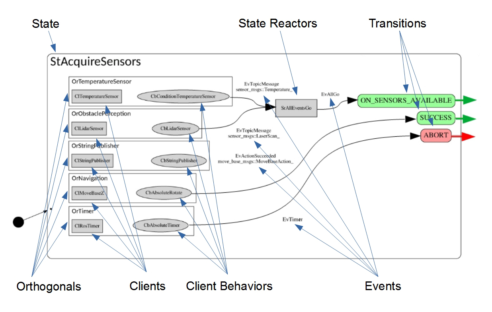
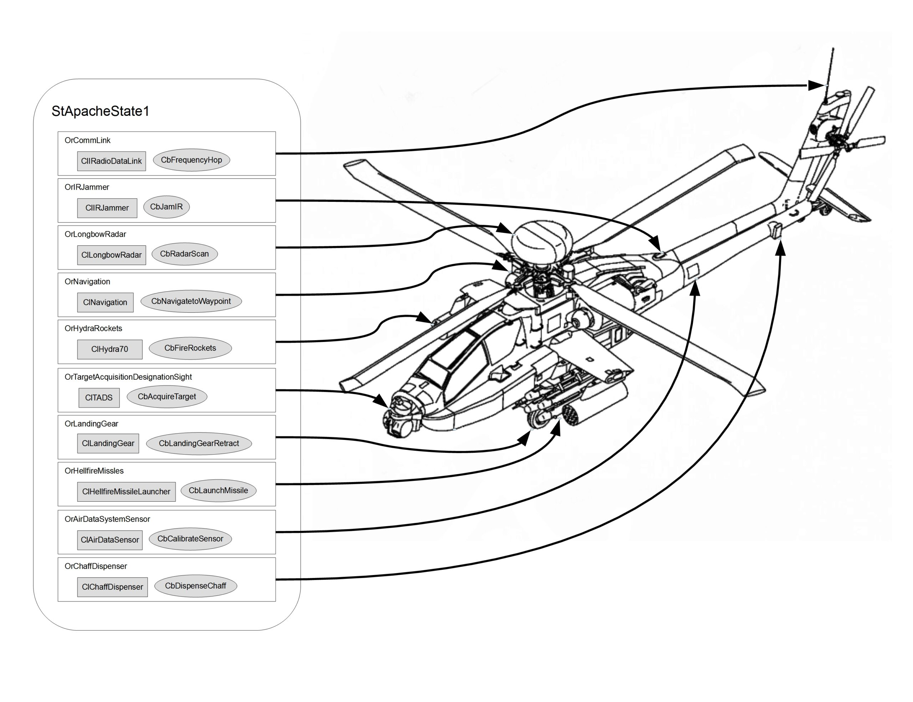
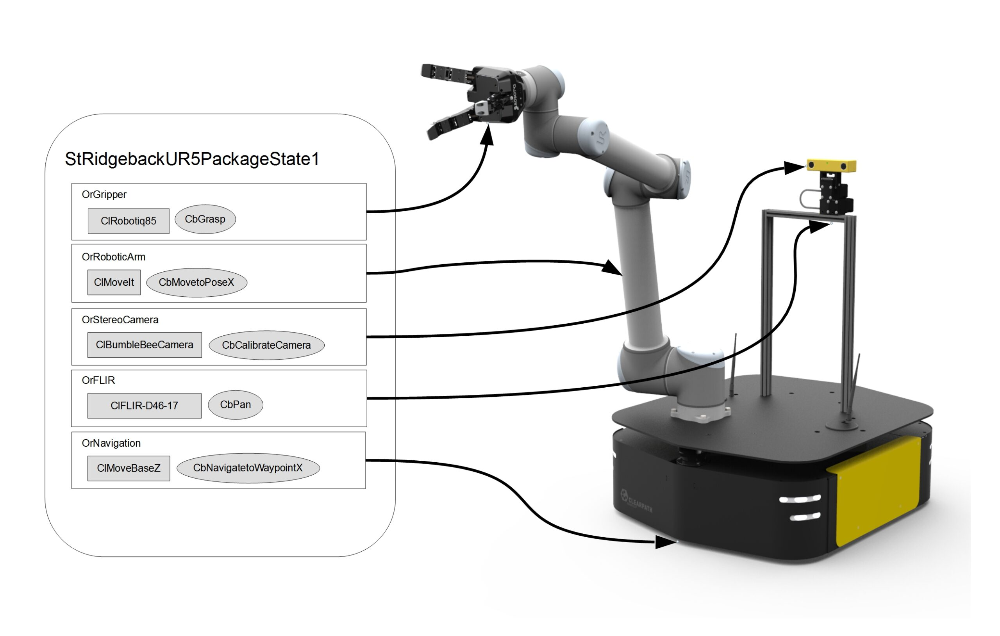
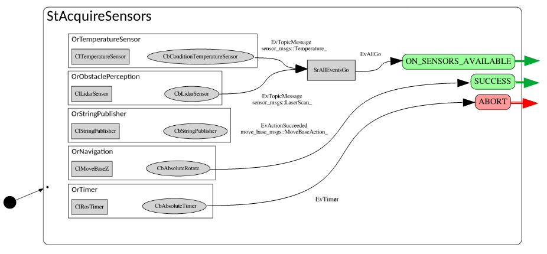
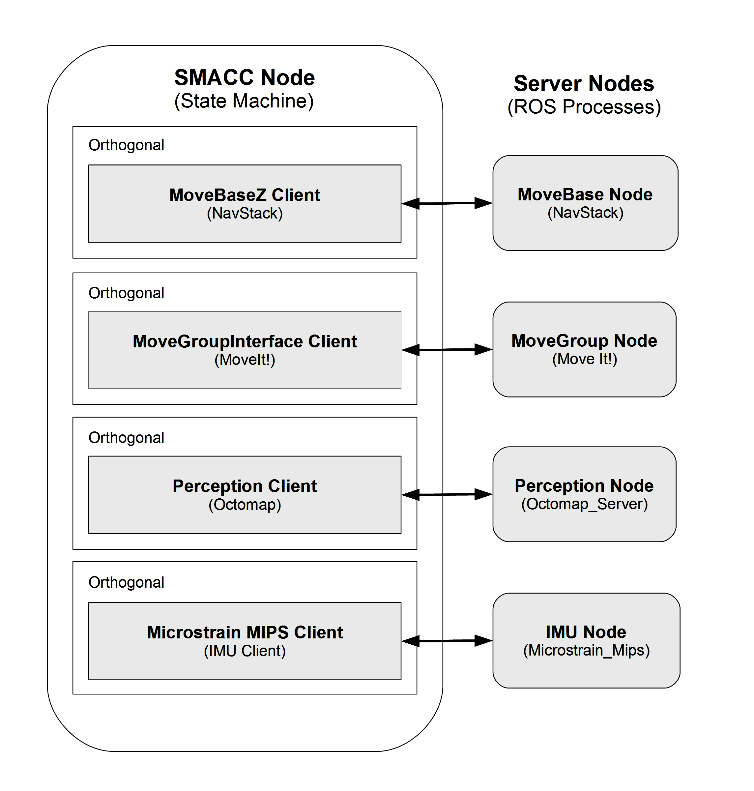

Concepts
=====

Intro to Substate Objects
------------

State Machines, are ultimately about the organization of code.

Let’s take a look at the taxonomy of SMACC objects inside of leaf state below, StAcquireSensors…

Let’s go through the objects one by one…

**Orthogonals:** Orthogonals are persistent for the life of the state machine. They can conceptually can be thought of as modular slots for the hardware devices that comprise a robot. Every Orthogonal should contain at least one client, and may contain multiple client behaviors. For more on orthogonals, click here.

**Clients:** Client objects are persistent for the life of the state machine. They are typically used to do things like, manage connections to outside nodes and devices, and contain code that we would want executed regardless of the current state. Clients are an important source of events.

**Client Behaviors:** Client behaviors are objects that are persistent for the life of the state. For this reason, they are used to execute state specific behaviors. In a given state, there can be multiple client behaviors in any orthogonal.

**State Reactors:** State Reactors are objects that receive events, and then generate one or more events. A good example of their use in practice, is the case of the state reactor, SrAllEventsGo. This State Reactor was created to deal with the following use case… A robot enters a state (in this case StAcquireSensors) where it wants to confirm that two different sensors have both been loaded and are working properly before moving onto the next state. So in this case, SrAllEventsGo needs to recieve two events, one from the temperature sensor orthogonal, and one from the lidar sensor, before the state reactor throws it’s own event, EvAllGo, which triggers the transition to next state.

**Events:** SMACC is an event-driven state machine library. As can be seen in the above example, events are created by Clients & Client Behaviors (although they can be created by States as well), then they are consumed by State Reactors & States. With the main difference being that State Reactors input events and output events, while states input events and output transitions.

Here is the code for the example image above…

.. code-block:: c++

   #include <smacc/smacc.h>       
   namespace sm_dance_bot_strikes_back                     
   {       

   // STATE DECLARATION               
   struct StAcquireSensors : smacc::SmaccState<StAcquireSensors, MsDanceBotRunMode>                       
   {       
      using SmaccState::SmaccState; 

   // DECLARE CUSTOM OBJECT TAGS       
      struct ON_SENSORS_AVAILABLE : SUCCESS{};       
      struct SrAcquireSensors;    

   // TRANSITION TABLE       
      typedef mpl::list<       
   
      Transition<EvAllGo<SrAllEventsGo, SrAcquireSensors>, StEventCountDown, ON_SENSORS_AVAILABLE>, 
      Transition<EvActionSucceeded<CbAbsoluteRotate, OrNavigation>, StEventCountDown, SUCCESS>,   
      Transition<EvTimer<CbAbsoluteTimer, OrTimer>, StPreviousState, ABORT>               
      
      >reactions;       

   // STATE FUNCTIONS     
      static void staticConfigure()       
      {       
         configure_orthogonal<OrTemperatureSensor, CbConditionTemperatureSensor>();          
         configure_orthogonal<OrObstaclePerception, CbLidarSensor>();            
         configure_orthogonal<OrStringPublisher, CbStringPublisher>("Hello World!");          
         configure_orthogonal<OrNavigation, CbAbsoluteRotate>(360);       
         configure_orthogonal<OrTimer, CbAbsoluteTimer>(10);       
   
   // Create State Reactor        
         auto srAllSensorsReady = static_createStateReactor<SrAllEventsGo>();              
         srAllSensorsReady->addInputEvent<EvTopicMessage<CbLidarSensor, OrObstaclePerception>>();
         srAllSensorsReady->addInputEvent<EvTopicMessage<CbConditionTemperatureSensor, OrTemperatureSensor>>();                              
         srAllSensorsReady->setOutputEvent<EvAllGo<SrAllEventsGo, SrAcquireSensors>>();      
      }       
   };         
   } // namespace sm_dance_bot_strikes_back 

|
 |
Orthogonals
----------------

*“An obvious application of orthogonality is in splitting a state in accordance with its physical subsystems.”* – Harel (1987) pg. 14

Orthogonality, one of the three additions to state machine formalism originally contributed by Harel in his 1987 paper, is absolutely crucial for the construction of complex robotic state machines. This is because complex robots are, almost by definition, amalgamations of hardware components such as sensors, cameras, actuators, encoders, sub-assemblies, etc.

In SMACC, Orthogonals are classes, defined by header files in their respective state machine, created by the State Machine upon start-up, then inherited by every Leaf State in that state machine, that serve as a container for clients, client behaviors, othogonal components, maybe shared pointers. For the most common use cases, they contain one Client, and either zero, one or multiple client behaviors in any one state.

They also function as namespace (I like to think of them as a last name), that allows you to specify and diffentiate between multiple instances of the same client in one state machine. For example, imagine a robot that has two arms, that both use their own instance of the SMACC MoveIt Client found in the SMACC client library, each running in a unique orthogonal (like OrLeftArm, OrRightArm).

The typical case, is that each device, such as an imu, a lidar scanner, a robot arm or a robot base, will be managed in it’s own orthogonal.

Let’s look at the examples below, and remember from the naming convention page, that…

- OrCommLink = Communications Link Orthogonal
- ClRadioDataLink = Radio Data Link Client
- CbFrequencyHop = Frequency Hop Client Behavior

To see Orthogonal code, here are some examples from the sm_reference_library..

https://github.com/reelrbtx/SMACC/blob/master/smacc_sm_reference_library/sm_dance_bot/include/sm_dance_bot/orthogonals/or_navigation.h

Event Model
----------------

In the recommended SMACC Event Model, events are generated by Clients & Client Behaviors, from inside their respective Orthogonals. These events are then consumed by either the State Reactors, or by the States themselves. When State Reactors consume events, they then output another event. And when States consume an event, they output a transition to another state. 

.. list-table:: 
   :widths: 125 75 75 75
   :header-rows: 1
   :align: center

   * - Entity
     - Inputs
     - Output
     - Lifetime
   * - State
     - Events
     - Transitions
     - Temporal
   * - State Reactor
     - Events
     - Events
     - Temporal
   * - Client
     - ROS Msgs
     - Events
     - Persistent
   * - Client Behavior
     - ROS Msgs
     - Events
     - Temporal

States, and their functions, are allowed to generate events directly as well, but this is discouraged.

One reason is that once more than one event is generated by the state, it becomes difficult to track what is going on in the SMACC Viewer. Another reason, is that event generation is often tied to callback functions, and to be thread-safe, the callback function needs to be placed in the client behavior (or client). Otherwise, a message/service/action can come into the ROS queue, but the State containing the callback function may have already vanished. 

Clients
------------

Client Behaviors
------------

**Default Events**

Client behaviors that inherit from smacc_asynchronous_client_behavior’s have three default events…

- SUCCESS through EvCbSuccess
- FINISH through EvCbFinished
- FAILURE through EvCbFailure

State Reactors
------------

In an event-driven state machine…

Events -> Reactions ->Other Events

And as functors are to functions, Reactors are to reactions, namely, a class that behaves as a reaction.

State Reactions accept events as an input, and output events. They are scoped to the lifetime of the state that declares them.

This is in contrast to states, which also accept events as input, but then output transitions and parameter changes (important for State Machine determinism).
