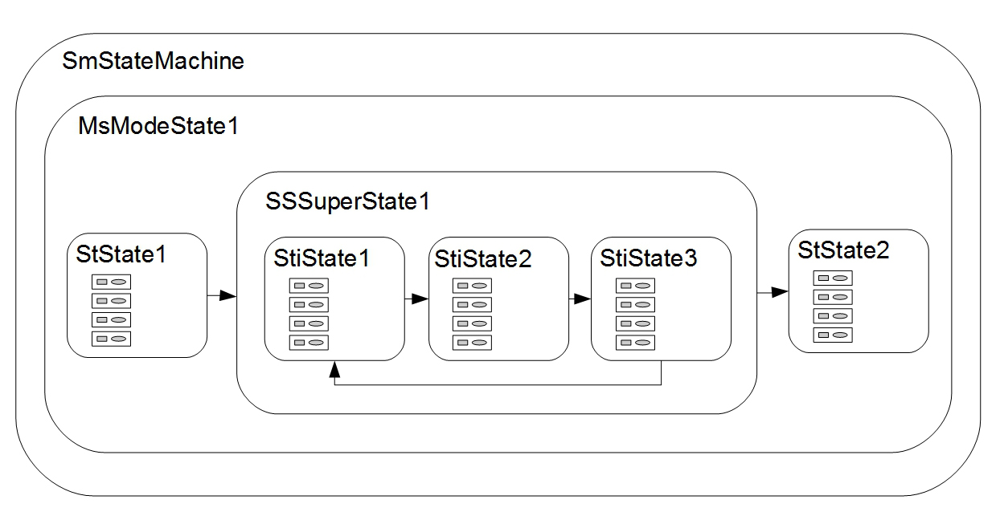
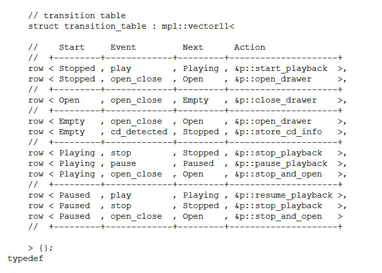

Concepts I - HSM Architecture
=====

Hierarchal States
----------------
Let’s talk about SMACC support for hierarchical states…

We need to make a distinction between parent states & leaf states. Leaf states being defined as those states that do not have any child states. In the example above, StState1, StState2, StiState1, StiState2 and StiState3 are leaf states.

As can be seen in the image above, only leaf states should have orthogonals. The reason for this being that only the leaf states interact with the hardware interface, where the higher level parent states such as superstates and modestates, define sequences of states, looping of states, parameter changes, etc.

SMACC States
------------

**State Functions**

- staticConfigure() – For static configuration of orthogonals.
- runtimeConfigure() – For runtime configuration of orthogonals.
- onEntry() – For RT Steady State. Here it is assumed that everything has been configured, and you are ready to roll.
- update()
- onExit() – Self explanatory 

|
|

Transitions
----------------

In 2003, David Abrams, founder of the Boost Libraries, Author of boost.mpl and Aleksey Gurtovoy, wrote an example for their MPL library that encompassed a state machine (procedural) and the first Transition Table. Seen below…

https://www.boost.org/doc/libs/1_72_0/libs/mpl/example/fsm/player1.cpp

This table, was extremely popular and was adopted almost unchanged into other state machine libraries such as boost.MSM.

In the boost.MPL library, only procedural state machines could be written, and the transition table was for the entire state machine.

In SMACC we’ve adapted the Transition Table to the behavioral state machine (along with Boost Statechart) by including a transition table inside of every state.
